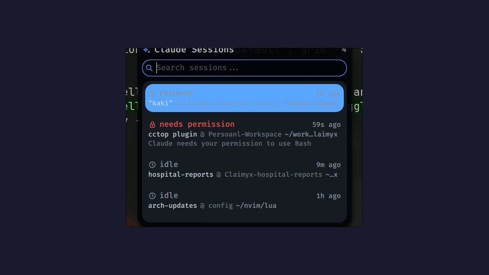

# Claude Sessions

A Noctalia bar widget for monitoring active [Claude Code](https://claude.ai/code) sessions. Powered by [cctop](https://github.com/DeanLa/cctop) hook data.



## Features

- **Bar widget** — compact session counts with colored status indicators
  - Green dot: active (thinking, tool use)
  - Gray dot: idle
  - Red diamond: waiting for input/permission
- **Session panel** — click the widget or press the keybind to open
  - Search/filter by session name or tmux session
  - Keyboard navigation (Ctrl+N/P or arrow keys, Enter to select, Esc to close)
  - Click or press Enter to focus the session's terminal and tmux window
- **Tmux integration** — switches to the correct tmux session and window, works with detached sessions
- **Auto-starts cctop poller** — enriches session data with names, token counts, and more

## Requirements

- [cctop](https://github.com/DeanLa/cctop) Claude Code plugin (provides the session hooks)
- `jq` — JSON processor
- `tmux` — for session focus feature
- Hyprland — for window focus (uses `hyprctl`)

## Installation

1. Clone into your Noctalia plugins directory:
   ```bash
   git clone https://github.com/SharonFabin/noctalia-claude-sessions.git \
     ~/.config/noctalia/plugins/claude-sessions
   ```

2. Register in `~/.config/noctalia/plugins.json`:
   ```json
   "claude-sessions": {
     "enabled": true,
     "sourceUrl": "local"
   }
   ```

3. Restart Noctalia:
   ```bash
   qs kill -c noctalia-shell && qs -c noctalia-shell -d
   ```

4. Enable in **Settings > Plugins**, then add to your bar in **Settings > Bar**.

## Keybind (optional)

Add to your Hyprland config to toggle the panel with a hotkey:

```
bind = SUPER, I, exec, qs ipc -c noctalia-shell call plugin:claude-sessions toggle
```

## How it works

The widget reads session status files from `~/.cctop/` written by cctop's Claude Code hook. Every 2 seconds it scans for active sessions, merges poller data for session names, and updates the bar and panel.

When focusing a session, it finds the terminal window via the tmux client's process tree and uses `hyprctl` to bring it to the front.
