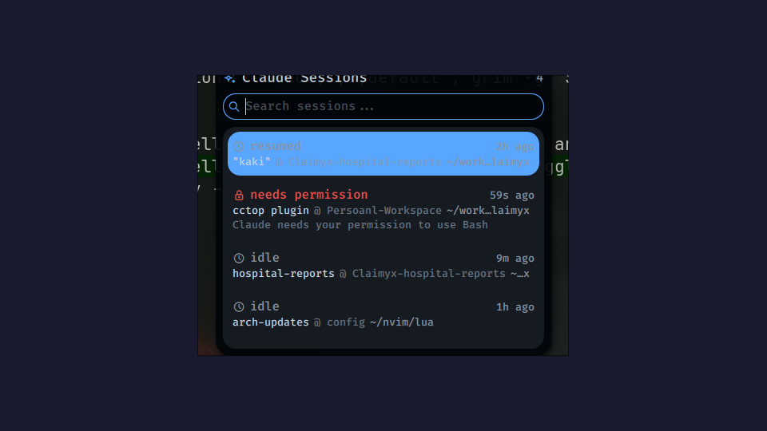

# AI Agent Sessions

A Noctalia bar widget for monitoring active AI agent sessions. It prefers [herdr](https://herdr.dev/) agent panes, so Claude, Codex, and any other herdr-detected agents show in one place. If herdr is not running, it falls back to [cctop](https://github.com/DeanLa/cctop) hook data for Claude Code sessions.



## Features

- **Bar widget** — compact agent counts with colored status indicators
  - Green dot: active (thinking, tool use)
  - Gray dot: idle
  - Green check: done
  - Red diamond: waiting for input/permission
- **Session panel** — click the widget or press the keybind to open
  - Search/filter by agent, session name, workspace, tab, pane, tmux session, or path
  - Keyboard navigation (Ctrl+N/P or arrow keys, Enter to select, Esc to close)
  - Click or press Enter to focus the herdr terminal window, herdr workspace/tab, or the session's terminal and tmux window
- **Herdr integration** — reads `herdr pane list` and shows all panes with detected agents
- **Tmux integration** — switches to the correct tmux session and window, works with detached cctop sessions
- **cctop fallback** — keeps the original Claude Code hook support when herdr is unavailable

## Requirements

- `herdr` — for multi-agent session detection and herdr focus
- [cctop](https://github.com/DeanLa/cctop) Claude Code plugin (optional fallback)
- `jq` — JSON processor
- `tmux` — for cctop session focus
- Hyprland — for herdr and cctop window focus (uses `hyprctl`)

## Installation

1. Clone into your Noctalia plugins directory:
   ```bash
   git clone https://github.com/SharonFabin/noctalia-claude-sessions.git \
     ~/.config/noctalia/plugins/claude-sessions
   ```

2. Register in `~/.config/noctalia/plugins.json`:
   ```json
   "claude-sessions": {
     "enabled": true,
     "sourceUrl": "local"
   }
   ```

3. Restart Noctalia:
   ```bash
   qs kill -c noctalia-shell && qs -c noctalia-shell -d
   ```

4. Enable in **Settings > Plugins**, then add to your bar in **Settings > Bar**.

## Keybind (optional)

Add to your Hyprland config to toggle the panel with a hotkey:

```
bind = SUPER, I, exec, qs ipc -c noctalia-shell call plugin:claude-sessions toggle
```

## How it works

Every 2 seconds the widget tries `herdr pane list` and normalizes panes that report an `agent`. Herdr statuses map to the widget counts as:

- `working` -> active
- `idle`, `unknown` -> idle
- `done` -> done
- `blocked` -> waiting

When herdr is unavailable or reports no agents, the widget reads session status files from `~/.cctop/` written by cctop's Claude Code hook and preserves the original Claude-only behavior.

When focusing a herdr session, it asks herdr for the pane process info, walks up from the pane shell PID to find the owning Hyprland terminal window, switches to that Hyprland workspace, focuses the terminal, then focuses the containing herdr workspace and tab. Herdr does not currently expose a direct focus-by-pane-id command, so the panel displays the exact pane id for tabs that contain multiple panes. For cctop sessions, it finds the terminal window via the tmux client's process tree and uses `hyprctl` to bring it to the front.
